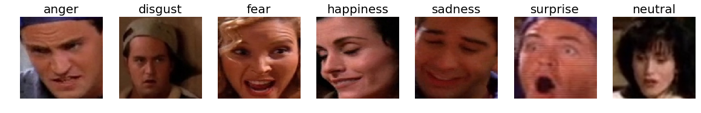

# VTT video emotion recognition

Video Emotion Recognition for VTT Friends dataset, trained with CK+ emotion labeled videos and AffectNet dataset



- - -

### Preliminaries
#### Packages
* python2
* tensorflow-gpu
* numpy
* opencv-python
* matplotlib
* face_recognition

#### Datasets
* AffectNet dataset [#](http://mohammadmahoor.com/affectnet/)
* Cohn-Kanade (CK+) dataset [#](http://www.consortium.ri.cmu.edu/ckagree/)
* VTT Friends dataset

#### Preprocessing
* Parsed AffectNet dataset can be indexed by loading and using `affectnet_parsed.npy` file
    * Parsed AffectNet dictionary has a categorical structure of [af_dict] -> [emotion label] -> [example index] -> ['img':image filenames], ['gt':ground truth bounding boxes], ['emo':emotion labels], ['aro':arousal intensity]
* CK+ dataset must be preprocessed using `face_recognition` package to find the face region of the subject, as shown in `ckplus_img_parse.ipynb`
* Parsed CK+ dataset can be indexed by loading and using `ckplus_parsed.npy` file
    * Parsed CK+ dictionary has the structure of [ck_dict] -> [subject number] -> [sequence index] -> ['img':image filename], ['emo':emotion label]
* VTT Friends dataset (episode 1-10) is used as the validation set
    * All frames of the videos should be extracted and saved as image files as in `vid_frame_parse.ipynb`
    * Metadata (json) files are used for processing as in `vid_metadata_parse.ipynb` to extract facial region images and emotion labels
    * The dataset can be indexed using `friends_valid.npy`, with the structure of [val_dict] -> [emotion label] -> [episode index] -> [period_character] -> [image filename list]


### Train
`model_train.py` is training script where directory path variables `DB_PATH` and `VA_PATH` should be the path for AffectNet dataset and VTT_friends dataset respectively. Training can be performed by running
```
python model_train.py
```
where the training process (error and accuracy) can be plotted by running,
```
python plot_errval.py
```

### Test
Testing for a video frame can be performed by importing the network model function by,
```
from model_forward import vid_emo_model
```
where the model function is vid_emo_model(input_img, op), input_img is the cropped RGB face image (224x224x3) and op is the network parameters defined as `net_params` in `model_train.py`

#### Results
Results for VTT_friends dataset is stored in `output_emotion.json` as,
```
{
    "episode_number": {
        "clipno_frameno": {
            "character": {
                "emotion": "emotion_label"
            }, 
...
```

- - -

#### References
* Cohn-Kanade (CK+) dataset
    - Kanade, T., Cohn, J. F., & Tian, Y. (2000). Comprehensive database for facial expression analysis. Proceedings of the Fourth IEEE International Conference on Automatic Face and Gesture Recognition (FG'00), Grenoble, France, 46-53.
    - Lucey, P., Cohn, J. F., Kanade, T., Saragih, J., Ambadar, Z., & Matthews, I. (2010). The Extended Cohn-Kanade Dataset (CK+): A complete expression dataset for action unit and emotion-specified expression. Proceedings of the Third International Workshop on CVPR for Human Communicative Behavior Analysis (CVPR4HB 2010), San Francisco, USA, 94-101.

* AffectNet dataset
    - Ali Mollahosseini, Behzad Hasani, and Mohammad H. Mahoor, “AffectNet: A New Database for Facial Expression, Valence, and Arousal Computation in the Wild”, IEEE Transactions on Affective Computing, 2017.

#### Acknowledgements

This work was supported by Institute for Information & communications Technology Promotion(IITP) grant funded by the Korea government(MSIT) (2017-0-01780, The technology development for event recognition/relational reasoning and learning knowledge based system for video understanding)
